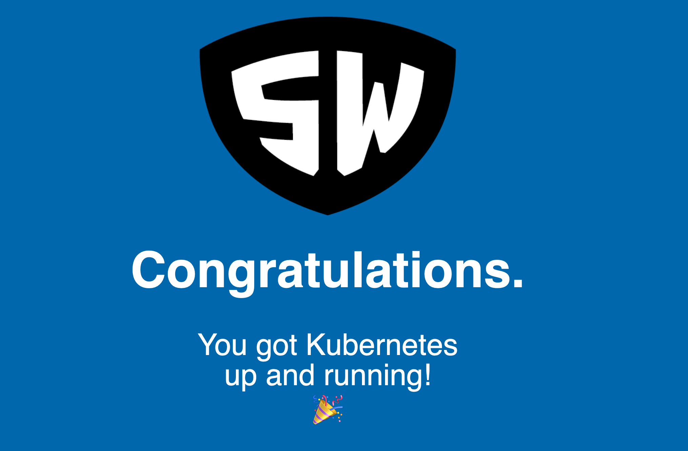

Welcome, Welcome, Welcome (to K8s)!
===================================

Hi.

This repository provides the implementation details of the Stark &
Wayne Welcome deployment, which you can use to vet and validate
your shiny new Kubernetes cluster.

To deploy it:

    kubectl apply -f https://starkandwayne.com/deploy/welcome-to-k8s.yml

You can port-forward directly to the pod like this:

    kubectl port-forward -n welcome svc/welcome 8080:80

... and then open up your browser and point it at <http://localhost:8080>.

It should look like this:

